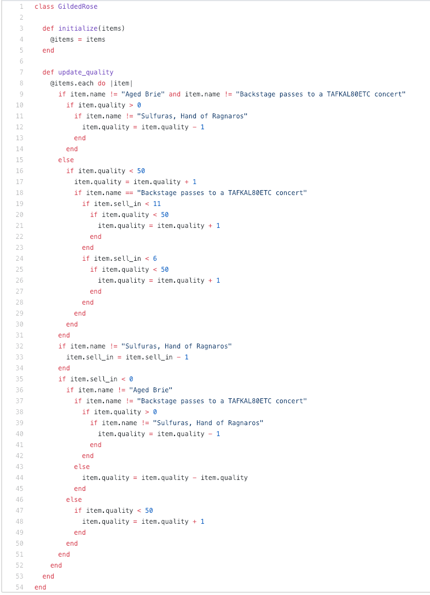
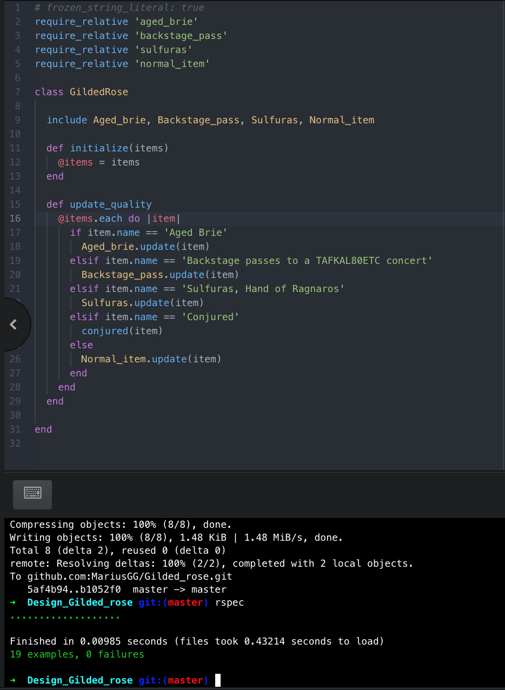

# Gilded Rose Project

This is my solution to the Gilded Rose Ruby kata.
It's an app for the Gilded Rose shop to update stocks, some stocks will increase and decrease depending on the behaviour. This project is design to help with further my object oriented design principles.


## Setup

**Install**
Clone/Download this repo to your local machine.

**Testing**

- You will need to run Bundle to install all dependencies
- Run Rspec for testing `spec/gilded_rose_spec.rb`
- Run Rubocop (linter)


### Feedback

This is a feedback section from the Makers Academy coaches for further implementations and OOP principles:

 Feedback 1:
 ```
@Marius this looks like a very nice start
However, I think that this could be refactored even further to make it super clean and elegant.
I suggest you do some research about a few specific topics and see if any of them give you inspiration…

• Inheritance
• Polymorphism
• Duck-typing
• Liskov Substitution Principle
 ```
 After this feedback, I went online to have a better understanding of Inheritance  and Polymorphism in ruby. I found some good examples at: https://www.webascender.com/blog/tutorial-classes-inheritance-modules-mixins-ruby-rails/
 This webpage helped me better understand the specific topic suggested and how I can best organise my code. I began refactoring the code by implementing more ternary operators. Also by extracting the items into modules I was able to include them back into the main gilded rose file and call the update method from the module.
 I used modules as I felt they were like a tool box with different tools I can call and no instantiation needed.
### Code Exemplar

<table>
     <tr><th></th><th></th>

   </table>

### Exemplar

**Sandi Metz, author of "Practical Object-Oriented Design in Ruby"**

Sandi Metz covers the Gilded Rose kata brilliantly and if you have some spare time or you can watching it at 1.5 speed. She covers why OOP code is easier and cleaner then procedural coding, Below is the link to that conference talk.


[All The Little Things by Sandi Metz](https://www.youtube.com/watch?v=8bZh5LMaSmE)
